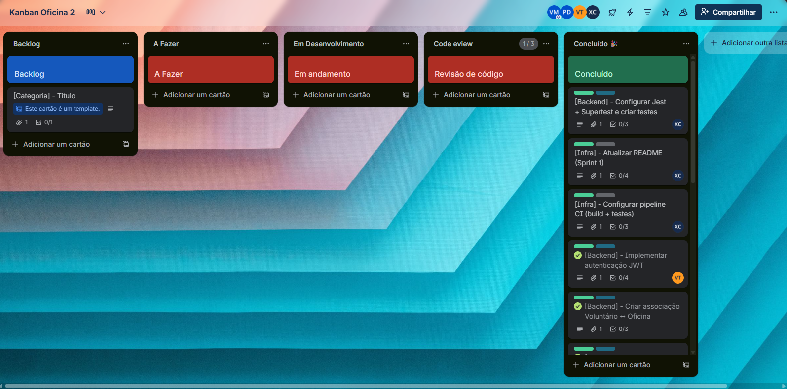
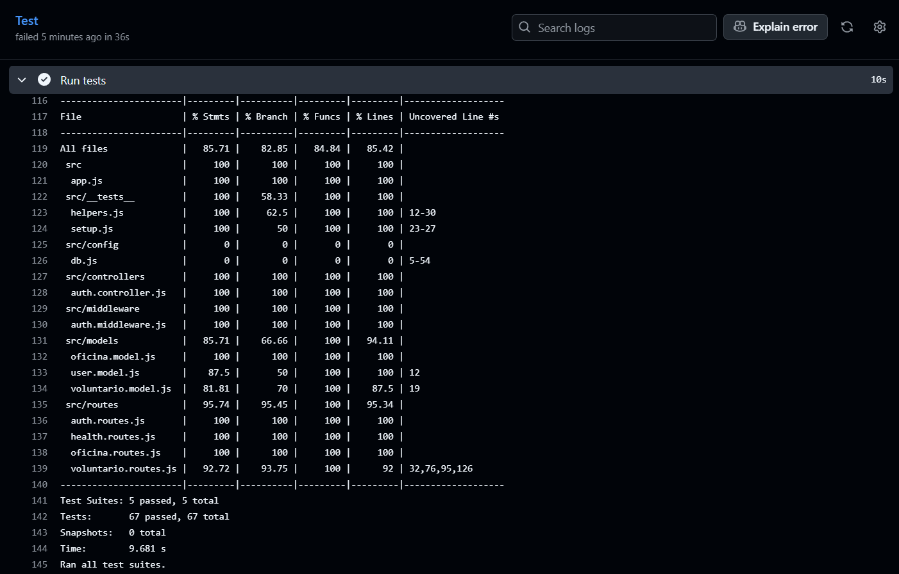

# 📋 Sprint 1 - Documentação

Documentação completa da Sprint 1 do projeto Sistema de Controle de Voluntários.

---

## 📊 Quadro Kanban



> 📝 **Nota:** Adicione o print do quadro Kanban (GitHub Projects, Trello, Jira, etc.) em `docs/kanban-sprint1.png` mostrando o progresso da Sprint 1.

---

## 🧪 Testes Automatizados

O backend possui testes automatizados utilizando **Jest** e **Supertest**, garantindo a confiabilidade da API.

**Executar testes:**

```bash
npm run test              # Executa testes
npm run test:coverage      # Executa com relatório de cobertura
```

**Estrutura dos testes:**

```
server/src/__tests__/
├── auth.test.js              # Testes de autenticação
├── auth.middleware.test.js   # Testes do middleware de autenticação
├── voluntario.test.js        # Testes CRUD de voluntários
├── oficina.test.js          # Testes CRUD de oficinas
├── health.test.js           # Testes de health check
├── helpers.js               # Funções auxiliares para testes
└── setup.js                 # Configuração do MongoDB em memória
```

**Cobertura de Testes:**

- ✅ Autenticação (login, register)
- ✅ Middleware de autenticação e autorização
- ✅ CRUD completo de Voluntários
- ✅ CRUD completo de Oficinas
- ✅ Health check da API

---

## 🔄 Integração Contínua (CI/CD)

A integração contínua está configurada com **GitHub Actions**, garantindo que todo **push** e **pull request** dispare automaticamente o workflow de build e testes.

📄 **Arquivo:** `.github/workflows/ci.yml`

### Pipeline CI/CD

O workflow executa automaticamente em:

- **Push** para a branch `main`
- **Pull Requests** para a branch `main`

**Etapas do Pipeline:**

1. ✅ **Checkout** do código
2. ✅ **Setup Node.js 20** com cache de dependências npm
3. ✅ **Instalação de dependências** (`npm ci`) - funciona automaticamente com npm workspaces
4. ✅ **Execução dos testes** (`npm run test:coverage`) - roda testes do workspace server
5. ✅ **Build do projeto** (`npm run build`) - builda client e server

### Status Checks

O workflow retorna status de **sucesso** ou **falha**:

- ✅ **Sucesso:** Todos os testes passaram → PR pode ser mesclado
- ❌ **Falha:** Testes falharam → PR **bloqueado** para merge

### Print do Pipeline



> 📝 **Nota:** Adicione o print da pipeline após executar o workflow no GitHub Actions. O arquivo deve ser salvo em `docs/pipeline-ci-cd.png`.

### Configuração de Branch Protection

Para garantir que PRs não sejam mesclados com testes falhando:

1. Vá em **Settings** → **Branches** no repositório GitHub
2. Adicione uma regra de proteção para a branch `main`
3. Marque **"Require status checks to pass before merging"**
4. Selecione o check **"CI / Test"** (ou o nome do seu job)

✅ **Critérios de Aceite:**

- ✅ Workflow executa corretamente em push e PR
- ✅ Build e testes passam sem erros
- ✅ PRs não podem ser mesclados se os testes falharem

---

## 📡 API Endpoints

### 🔐 Autenticação (`/auth`)

| Método | Endpoint         | Descrição                         | Acesso  |
| ------ | ---------------- | --------------------------------- | ------- |
| `POST` | `/auth/register` | Registra um novo usuário          | Público |
| `POST` | `/auth/login`    | Realiza login e retorna token JWT | Público |

**Exemplo de Registro:**

```json
POST /auth/register
{
  "email": "admin@example.com",
  "password": "senha123",
  "role": "admin"  // ou "voluntario"
}
```

**Exemplo de Login:**

```json
POST /auth/login
{
  "email": "admin@example.com",
  "password": "senha123"
}

// Resposta:
{
  "token": "eyJhbGciOiJIUzI1NiIsInR5cCI6IkpXVCJ9...",
  "role": "admin"
}
```

### 👥 Voluntários (`/voluntarios`)

| Método   | Endpoint                  | Descrição                        | Acesso            |
| -------- | ------------------------- | -------------------------------- | ----------------- |
| `POST`   | `/voluntarios`            | Cria um novo voluntário          | Admin             |
| `GET`    | `/voluntarios`            | Lista todos os voluntários       | Admin             |
| `GET`    | `/voluntarios/:id`        | Busca voluntário por ID          | Admin             |
| `GET`    | `/voluntarios/me`         | Acessa própria página de usuário | Admin, Voluntário |
| `PUT`    | `/voluntarios/:id`        | Atualiza voluntário por ID       | Admin             |
| `DELETE` | `/voluntarios/:id`        | Deleta voluntário por ID         | Admin             |
| `POST`   | `/voluntarios/:id/assign` | Associa oficina a um voluntário  | Admin             |

**Exemplo de Criação:**

```json
POST /voluntarios
Headers: { "Authorization": "Bearer <token>" }
{
  "nome": "João Silva",
  "cpf": "123.456.789-00",
  "rg": "12.345.678-9",
  "email": "joao@example.com",
  "telefone": "(11) 98765-4321",
  "endereco": "Rua Exemplo, 123",
  "dataEntrada": "2024-01-15",
  "ativo": true
}
```

### 🏛️ Oficinas (`/oficinas`)

| Método   | Endpoint        | Descrição               | Acesso |
| -------- | --------------- | ----------------------- | ------ |
| `POST`   | `/oficinas`     | Cria uma nova oficina   | Admin  |
| `GET`    | `/oficinas`     | Lista todas as oficinas | Admin  |
| `GET`    | `/oficinas/:id` | Busca oficina por ID    | Admin  |
| `PUT`    | `/oficinas/:id` | Atualiza oficina por ID | Admin  |
| `DELETE` | `/oficinas/:id` | Deleta oficina por ID   | Admin  |

**Exemplo de Criação:**

```json
POST /oficinas
Headers: { "Authorization": "Bearer <token>" }
{
  "titulo": "Oficina de Programação",
  "descricao": "Introdução à programação para iniciantes",
  "data": "2024-02-20",
  "local": "Sala 101",
  "responsavel": "Prof. Maria"
}
```

### ❤️ Health Check (`/health`)

| Método | Endpoint  | Descrição              | Acesso  |
| ------ | --------- | ---------------------- | ------- |
| `GET`  | `/health` | Verifica status da API | Público |

**Resposta:**

```json
{
  "status": "OK"
}
```

### 🔑 Autenticação nas Requisições

Para endpoints protegidos, inclua o token JWT no header:

```
Authorization: Bearer <seu_token_jwt>
```

### 📝 Notas Importantes

- Todos os endpoints protegidos requerem autenticação via JWT
- Apenas usuários com role `admin` podem acessar a maioria dos endpoints
- O endpoint `/voluntarios/me` é acessível por ambos os roles (`admin` e `voluntario`)
- Ao atualizar um voluntário com `dataSaida`, o sistema automaticamente marca como `ativo: false`

---

## 📦 Entregas da Sprint 1

### ✅ Funcionalidades Implementadas

- ✅ CRUD completo de Voluntários
- ✅ CRUD completo de Oficinas
- ✅ Sistema de autenticação JWT
- ✅ Middleware de autenticação e autorização por roles
- ✅ Associação de voluntários a oficinas
- ✅ Health check da API
- ✅ Testes automatizados com cobertura
- ✅ Pipeline CI/CD configurado

### 📝 Requisitos Atendidos

- ✅ **RF01** - Cadastro de Voluntário
- ✅ **RF02** - Registro de Datas
- ✅ **RF03** - Atualização de Dados
- ✅ **RF04** - Inativação de Voluntário
- ✅ **RF05** - Cadastro de Oficinas
- ✅ **RF06** - Associação Voluntário–Oficina
- ✅ **RF11** - Autenticação e Perfis

---

## 🔗 Links Relacionados

- [README Principal](../README.md) - Como rodar o projeto
- [Definição do Projeto](DEFINICAO.md) - Visão geral e requisitos
